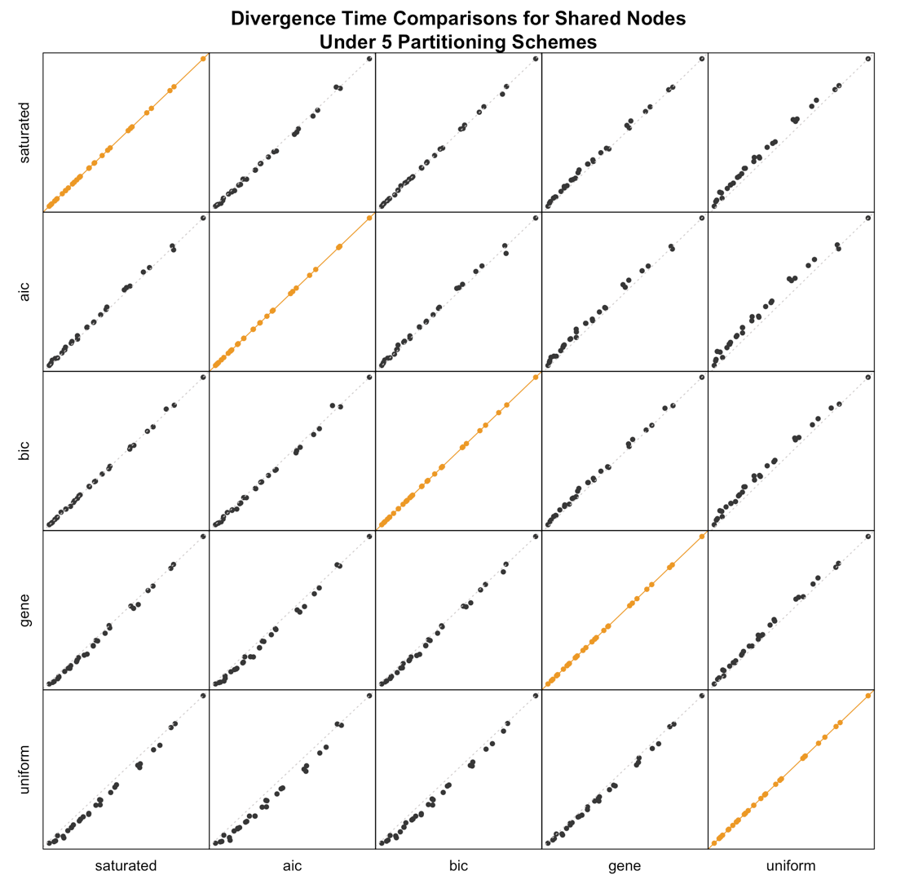
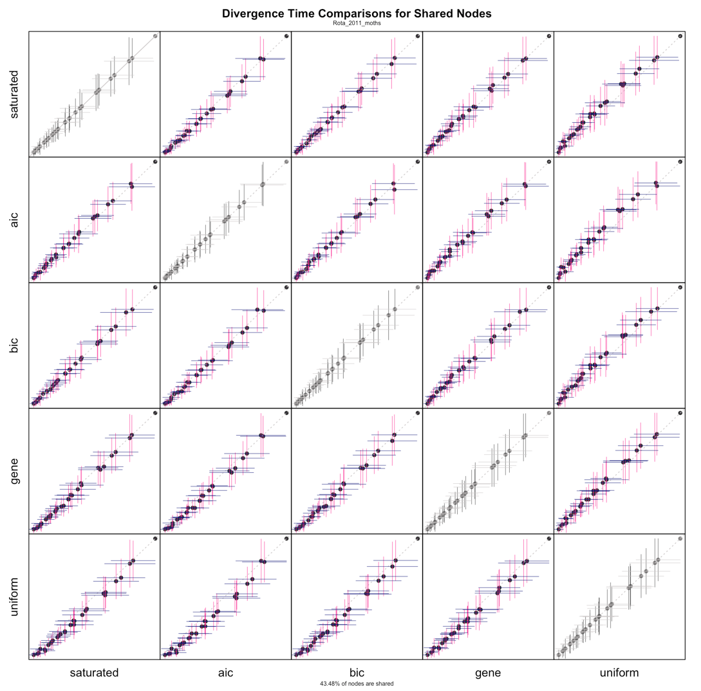
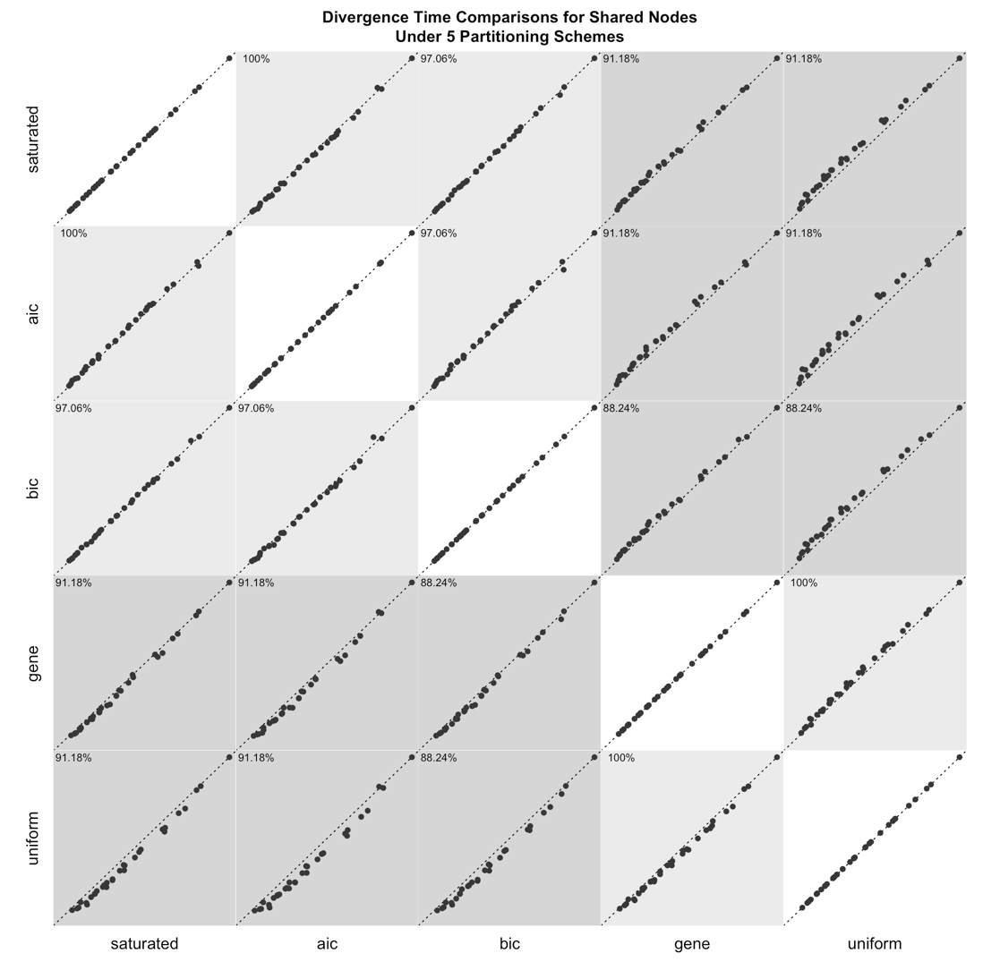
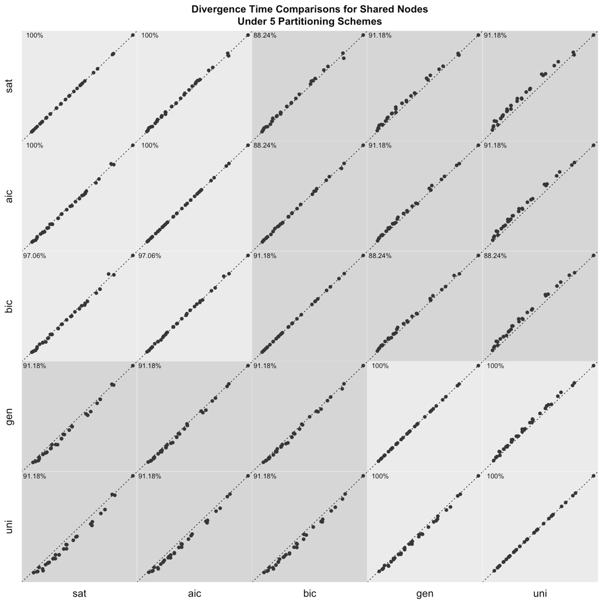

# CSNAP - Compare Shared Node Age Plots
```library(csnap)``` will give you access to the functions I'm using to compare inferred shared node ages between different analyses on the same dataset. Recent developments have led to a semi-generalizable plotting function ```csnapMulti()``` which takes in a total of ten different analyses on the same dataset to create a Compare Shared Node Age Plot. Future developments will allow for equally lengthed vectors as input to this function.

## Tutorial
This tutorial will describe Compare Shared Node Age Plots (CSNAPs). You can pronounce CSNAP like "sea-snap" or "kah-snap". Ask your neighbor how you think you should pronounce it. ;)

You can download the ```RMarkdown``` <a href="https://github.com/palautatan/csnap/blob/master/examples/csnaps.Rmd">here</a>.

## Building off of library(ape)
The library ```ape``` has a standard way of reading in a phylogenetic tree. The library ```phylotate``` extends upon that standard way. If you look at the class itself, it is a list consisting of edges, nodes, species, and more. I used the phylogenetic tree class in ```ape``` and parsed it to figure out which species fell under each node based on the numbering systems in ```ape```. The end product is a list relating species and node numbers.

Let's load in our libraries.
```{r, , warning=FALSE}
# * LIBRARIES
library(ape)
library(phylotate)
```

The last library we need is the ```csnap``` library. Download it via <a href="https://github.com/palautatan/csnap">GitHub</a> before you proceed.
```{r}
# * CSNAP LIBRARY
library(csnap)
```

Now that we have the ```csnap``` library, I'll provide examples on how to use them and their differences.

## 1. csnap()
The csnap function takes in a path to 5 differently partitioned analyses' ```.tre``` files named "perfectly" according to my project's partitions. If you are working on further generalizion of this function, then you have to rethink all of my hardcoding for the different partitioned analyses. It should be straightforward.

When you run this function, you will see several ```is.na()``` warnings, and it is safe to ignore them.

```{r, warning=FALSE, message=FALSE}
# CSNAP FUNCTION
csnap(path_to_tre_files)
```



Each of the data points above represent a node that all of the trees inferred by each of the analyses shared. That is, there are the same amount of data points in each plot.

## 2. csnapWhisker()
The ```csnapWhisker()``` function is the same as ```csnap()``` but adds whiskers to represent the 95% credible interval.

```{r, warning=FALSE, message=FALSE}
# CSNAPWHISKER FUNCTION
csnapWhisker(path_to_tre_files)
```


On the bottom of the plot, we see how many percent of the nodes are shared amongst all the different analyses. This is something I should also add to the output plot of ```csnap()```.

## 3. csnapPairs()
Instead of plotting only the shared nodes amongst all analyses, ```csnapPairs()``` plots pairwise shared nodes.That is, there can be different amounts of data points in each plot.
```{r, warning=FALSE, message=FALSE}
# CSNAPPAIRS FUNCTION
csnapPairs(path_to_tre_files)
```


## 4. csnapMulti()
This function works particularly different than the other functions. Its parameter input were used to be able to "generalize" csnapPairs() for comparing multiple runs. I will first list my files from te directories I have chosen.
```{r}
# LIST FILES
files_1 = list.files(folder_1, pattern=".tre$", full.names=TRUE)
files_2 = list.files(folder_2, pattern=".tre$", full.names=TRUE)
```


Then, I will use the same vector of labels for both analyses using ```csnapMulti()```.
```{r, warning=FALSE, message=FALSE, fig.width=10, fig.height=10}
labels = c("sat", "aic", "bic", "gen", "uni")
csnapMulti(files_1, files_2, labels, labels)
```



In the future, I should make this function work for equally lengthed vectors of analyses on the same dataset.

## The Identity Line
The line $y=x$, the $1:1$ line, or the identity line is plotted in each of the subplots above. If the shared node ages were inferred to be the same, the points would line up on the identity. The subplots along the diagonal from the top left plot to the bottom right are the only ones that will follow the identity line because they are the same analysis plotted twice. All other plots will deviate from the identity line.

In Compare Tree Plots, the correlation coefficient $R^2$ is used to measure the relationship between the two plots' variables' posterior probabilities. The correlation coefficient is actually quite robust to data that are in Compare Tree Plots and CSNAPs because of a strong cluster of data points that lie close to 0 for both analyses.

Instead of using $R^2$ to make conclusions about the relationships between the inferred data points, use it as a guide, and look carefully at the plots instead. Instead of using $R^2$ to make conclusions about the relationships between the inferred data points, you can use it as a guide, and look carefully at the plots instead. I did not include $R^2$ in my CSNAPs.
